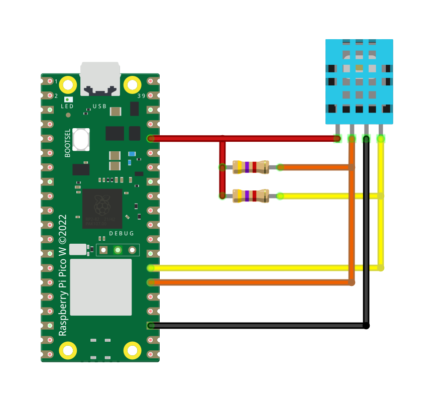

# DHT20 Temperature And Humidity Sensor Library
## About
This is a temperature and humidity sensor DHT20 driver for Raspberry Pi Pico.

## Connection

Both resistors are 4K7R.

## Function
### `init(SCL, SDA, FREQ)`
Initialize the DHT20 temperature and humidity sensor.
### `get_data()`
Receiving and analyzing measurement data. The obtained data is assigned to **temperature_data** and **humidity_data**.
### `to_json()`
Convert temperature and humidity data into JSON format.

## Example
```py
from machine import Pin
import time, dht20

led = Pin("LED", Pin.OUT)

dht20.init()
time.sleep_ms(100)

while True:
    led.toggle()
    dht20.get_data()
    print(dht20.to_json())
    print(dht20.temperature_data)
    print(dht20.humidity_data)
    time.sleep(3)
```
### Output
```
MPY: soft reboot
DTH20 INIT SUCCESS
{"temperature": 23.57, "humidity": 56.48}
23.57
56.48
```
